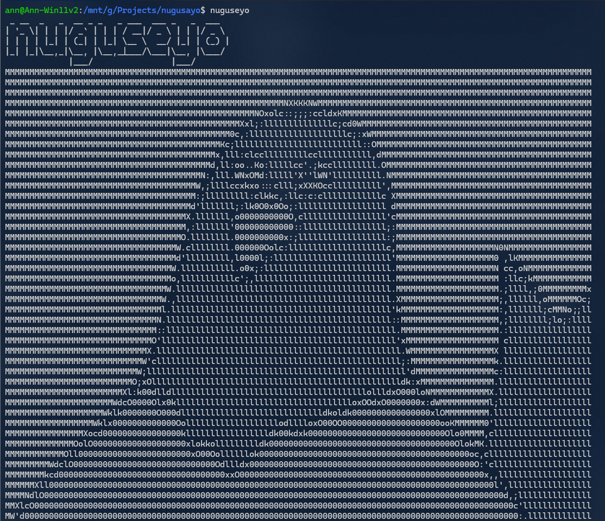

# Nuguseyo

## Installation

1. Install Nuguseyo
```
sudo apt install nuguseyo-package.deb
```

2. Run Nuguseyo
```
nuguseyo
```



Have fun!

## Usage

```
nuguseyo --help

Usage: nuguseyo [OPTIONS]
Options:
  --path <image_path>     指定要加載的圖片路徑 (預設: images/image1.png)
  --random                隨機選擇 images 資料夾中的一張圖片 (image1.png ~ image15.png)
  --colorful              啟用彩色輸出
  --help                  顯示此幫助信息
```

## Uninstall Nuguseyo

**Not recommend you to do this.**

```
sudo apt remove nuguseyo
```
